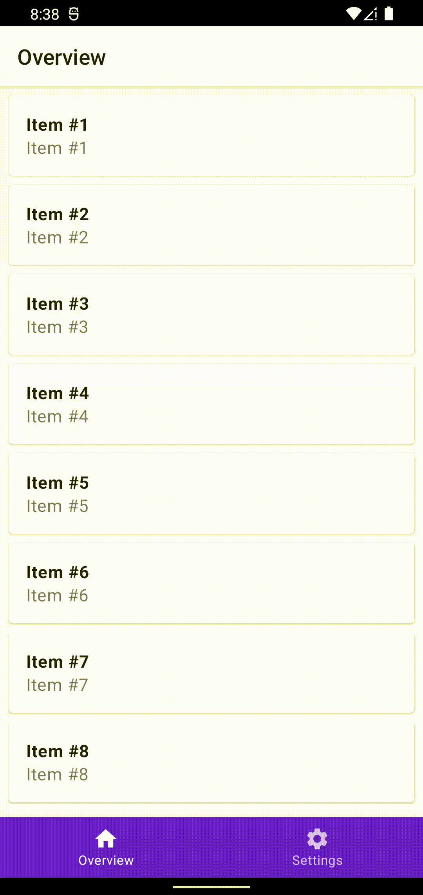

# Screen

## Thinking

A screen has 3 main pieces:

- A `UiState`, containing the current state of the screen (e. g., `ItemDetailsUiState` holds an `Item`);

- A `ScreenViewModel`, that holds the `UiState` and is responsible for updating it. And, since the `UiState`lives inside a `ViewModel`,
we (mostly) don't have to worry about state loss;

- A `Screen`, that holds the `ScreenViewModel`.

## Usage sample

Let's say we want to build 3 screens:

- "Overview", a bottom navigation tab with a list of items;
- "Item details", a child screen of Overview with the details of the selected item;
- "Settings", a bottom navigation tab with a giant icon as its content.

<div align="center">
    
</div>

### Overview

First, we would go about creating the Overview screen, and it would look something like this:

```kotlin
data class OverviewScreen(
    override val getActivity: () -> AppCompatActivity,
    override val getNavController: () -> NavController
): Screen.Tab, Screen.Parent {
    override val viewModelFactory = viewModelFactoryOf(Repository)
    override val viewModel: OverviewViewModel by viewModel()
    override val route = "overview"
    override val isHome = true
    override val icon = Icons.Default.Home
    override val children = listOf(ItemDetailsScreen(this))

    @Composable
    override fun Content(modifier: Modifier) {
        Overview(
            this,
            modifier
        )
    }
}
```

It's pretty straight-forward: the Overview screen will be the home one, meaning that it's going to be the first to launch when we open
the app. Since it is a `Screen.Parent`, we can add the Item details screen as its child.

Now that we have the `Screen`, let's create the `OverviewViewModel`:

```kotlin
class OverviewViewModel(screen: OverviewScreen, repository: Repository):
    ScreenViewModel<OverviewScreen, OverviewUiState>(screen) {
    override val initialUiState = OverviewUiState(repository.items)
}
```

Moving on, let's create the final piece of a screen, the `OverviewUiState`:

```kotlin
data class OverviewUiState(val items: List<Item> = emptyList()): UiState<OverviewScreen> {
    override val screenClass = OverviewScreen::class
    override val title = "Overview"
}
```

And... that's it! As for the other screens, the process would be pretty much the same.

Now, having created the `OverviewScreen`, the `ItemDetailsScreen` and the `SettingsScreen`, we can build our "top-level" UI, the one
that'll wrap all the rest:

```kotlin
@Composable
@OptIn(ExperimentalAnimationApi::class)
fun Main(
    activity: AppCompatActivity,
    modifier: Modifier = Modifier
) {
    val navController = rememberMaterialMotionNavController()
    val familyTree = FamilyTree(
        OverviewScreen({ activity }, { navController }),
        SettingsScreen({ activity }, { navController })
    )

    ScreenScaffold(
        familyTree,
        modifier
    ) { padding ->
        ScreenNavHost(
            navController,
            familyTree,
            Modifier.padding(padding)
        )
    }
}
```

Done! If you want to, you can find the complete implementation of the sample in the `:app` module.
